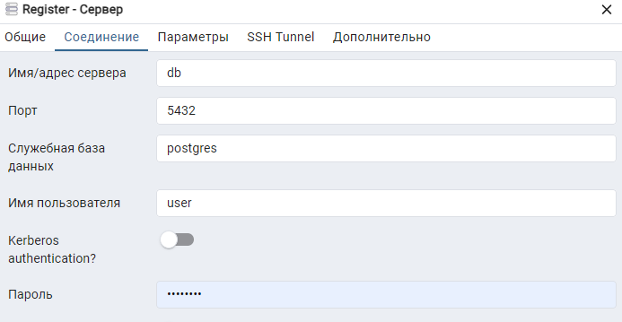

# Инструкция

### Запуск Docker

Для запуска docker контейнера с приложением потребуется установить docker-compose либо docker

После установки необходимо выполнить в консоли следующие команды:

***
#### Docker-compose
docker-compose up -d --build

docker-compose exec app-server sh
***
***
#### Docker
docker compose up -d --build

docker compose exec app-server sh
***

### Запуск приложения

По выполнении этих команд мы попадем в директорию /opt/server

Для запуска приложения необходимо в консоль ввести команду:
***
npm run dev
***

### Инициализация сущностей БД

Для инициализации базовых сущностей необходимо в консоль ввести команду:
***
npx sequelize-cli db:seed:all --env development
***

### Использование

По выполнении этих действий доступ к приложению производится по данным эндпоинтам:

#### http://localhost - Корень приложения

#### http://localhost/pgadmin - Управление БД

Данные для входа в pgadmin:

PGADMIN_EMAIL=example@bk.ru

PGADMIN_PASSWORD=password

Данные для создания сервера

 
DB_USERNAME=user

DB_PASSWORD=password

#### http://localhost/api/v1/docs - Документация API Swagger UI

Данные для авторизации на сервере под пользователем с ролью администратор:

ADMIN_USERNAME=admin

ADMIN_PASSWORD=password

